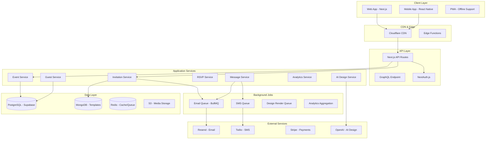

# BUZZINVITLY - COMPLETE TECHNICAL SPECIFICATION
*A Modern Event Invitation Platform - Enhanced Build Guide*

> **Project Name**: BuzzInvitly (Alternative: Paperzoop)
> **Tagline**: "Create Events That Buzz"
> **Mission**: Democratize beautiful event invitations with AI-powered design and social-first features

---

## TABLE OF CONTENTS
1. [Executive Summary](#executive-summary)
2. [Product Feature Specification](#product-features)
3. [Technical Architecture](#technical-architecture)
4. [Database Design](#database-design)
5. [API Specification](#api-specification)
6. [Implementation Roadmap](#implementation-roadmap)
7. [Security & Compliance](#security)
8. [Monetization Strategy](#monetization)
9. [Deployment Guide](#deployment)

---

## EXECUTIVE SUMMARY

### What Makes BuzzInvitly Different

**Competitive Advantages over Paperless Post:**
1. **AI Design Assistant**: Generate custom invitation designs from text prompts (ChatGPT/DALL-E integration)
2. **Social Virality**: Built-in referral system, social sharing optimization, viral invite mechanics
3. **Event Buzz Score**: Gamified engagement metrics that track event excitement
4. **Collaborative Planning**: Real-time co-hosting with live design collaboration
5. **Mobile-First**: Progressive Web App with full offline support
6. **Modern Stack**: Built on cutting-edge technology for superior performance

**Retained Paperless Post Strengths:**
- Beautiful, designer-quality templates
- Comprehensive guest management with tagging
- Multi-channel delivery (email, SMS, link)
- Advanced RSVP tracking with analytics
- Premium monetization model (coins + subscription)

---

## PRODUCT FEATURES

### 1. INVITATION TYPES & DESIGN SYSTEM

#### 1.1 Cards (Premium/Formal Events)
**Envelope Experience:**
```
┌─────────────────────────────┐
│  Animated Envelope Opening  │
│  ┌───────────────────────┐  │
│  │   Card Front          │  │
│  │   (Customizable)      │  │
│  └───────────────────────┘  │
│  Click to flip → Card Back  │
└─────────────────────────────┘
```

**Features:**
- Envelope customization (color, liner pattern, stamp)
- Double-sided card design
- Embossed text effects
- Foil accents (gold, silver, rose gold)
- Ribbon and border decorations
- Wedding-specific elements (monograms, crests)
- Print-quality export (PDF, 300 DPI)

**Best For**: Weddings, formal dinners, milestone celebrations, corporate galas

#### 1.2 Flyers (Casual/Shareable Events)
**Mobile-First Design:**
```
┌──────────────────┐
│  Animated BG     │
│  ┌────────────┐  │
│  │ Event Info │  │
│  │ + Stickers │  │
│  │ + GIFs     │  │
│  └────────────┘  │
│  [RSVP Button]   │
└──────────────────┘
```

**Features:**
- Animated backgrounds (parallax, video, lottie)
- GIF support
- Sticker library (500+ animated stickers)
- Confetti effects
- Sound effects on open (optional)
- Instagram Stories-style vertical format
- One-tap share to social media
- QR code generation for print materials

**Best For**: Birthdays, happy hours, casual parties, team events

#### 1.3 AI-Powered Design Generator ⭐ NEW
**Natural Language to Design:**
```typescript
Prompt: "Create an elegant garden wedding invitation with
        watercolor florals, sage green and gold accents,
        romantic script font"

→ AI generates 3 unique design variations
→ Select one and customize further
→ Save to personal template library
```

**Implementation:**
- OpenAI GPT-4 for design interpretation
- DALL-E 3 for background generation
- Midjourney API for designer-quality assets
- Template structure generation (auto-layout)
- Color palette extraction
- Font pairing suggestions

---

### 2. TEMPLATE SYSTEM

#### 2.1 Template Categories
```
Weddings (300 templates)
  ├── Engagement Announcements
  ├── Save the Dates
  ├── Ceremony Invitations
  ├── Reception Invitations
  ├── Rehearsal Dinners
  └── Post-Wedding Brunch

Birthdays (200 templates)
  ├── Kids (0-12)
  ├── Teens (13-17)
  ├── Milestone (18, 21, 30, 40, 50+)
  └── Surprise Parties

Baby & Kids (150 templates)
  ├── Baby Showers
  ├── Gender Reveals
  ├── Birth Announcements
  ├── First Birthdays
  └── Christenings/Naming Ceremonies

Corporate (100 templates)
  ├── Holiday Parties
  ├── Team Building
  ├── Product Launches
  ├── Conferences
  └── Networking Events

Holidays (150 templates)
  ├── Christmas/Hanukkah
  ├── New Year's Eve
  ├── Halloween
  ├── Thanksgiving
  └── Summer BBQs

Casual Social (100 templates)
  ├── Dinner Parties
  ├── Game Nights
  ├── Watch Parties
  └── Housewarming
```

#### 2.2 Template Structure (MongoDB Document)
```javascript
{
  _id: ObjectId,
  name: "Garden Romance Wedding",
  slug: "garden-romance-wedding",
  category: "weddings",
  subcategory: "ceremony",
  type: "CARD", // or "FLYER"

  // Metadata
  isPremium: true,
  coinCostPerInvite: 2, // NOT per template, per recipient sent
  designer: "BuzzInvitly Studios",
  designerPartner: "Rifle Paper Co.", // if applicable
  tags: ["wedding", "garden", "floral", "elegant", "spring"],

  // Design Configuration
  designConfig: {
    canvas: {
      width: 800,
      height: 1200,
      orientation: "portrait",
      format: "card" // or "flyer"
    },

    layers: [
      {
        id: "bg-1",
        type: "background",
        imageUrl: "https://cdn.buzzinvitly.com/templates/bg-garden.jpg",
        opacity: 0.9,
        blendMode: "normal",
        locked: true
      },
      {
        id: "text-1",
        type: "text",
        content: "{{eventTitle}}", // Variable
        font: {
          family: "Playfair Display",
          weight: 700,
          size: 48,
          letterSpacing: 2,
          lineHeight: 1.2
        },
        position: { x: 100, y: 200 },
        color: "#2C3E50",
        effects: {
          shadow: { x: 2, y: 2, blur: 4, color: "rgba(0,0,0,0.1)" },
          stroke: null
        },
        editable: true,
        maxLength: 100
      },
      {
        id: "img-1",
        type: "image",
        imageUrl: "{{customPhoto}}", // User upload slot
        position: { x: 50, y: 400 },
        size: { width: 700, height: 400 },
        borderRadius: 20,
        editable: true,
        placeholder: "Upload your photo"
      },
      {
        id: "sticker-1",
        type: "sticker",
        stickerUrl: "https://cdn.buzzinvitly.com/stickers/floral-corner.svg",
        position: { x: 650, y: 50 },
        size: 150,
        rotation: 0,
        editable: true,
        removable: true
      }
    ],

    // Customizable Variables
    variables: [
      { key: "eventTitle", label: "Event Title", type: "text", default: "You're Invited" },
      { key: "eventDate", label: "Date", type: "date", format: "MMMM DD, YYYY" },
      { key: "eventTime", label: "Time", type: "time", format: "h:mm A" },
      { key: "location", label: "Location", type: "text" },
      { key: "hostNames", label: "Hosted By", type: "text" },
      { key: "customMessage", label: "Message", type: "textarea", maxLength: 500 }
    ],

    // Premium Customization Options
    premiumOptions: {
      colorPalettes: [
        { name: "Original", colors: ["#2C3E50", "#E8D5B7", "#A8DADC"] },
        { name: "Sage & Gold", colors: ["#8B9D83", "#D4AF37", "#F5F5DC"] },
        { name: "Navy & Blush", colors: ["#1F2937", "#F3CFC6", "#FFFFFF"] }
      ],
      fonts: [
        "Playfair Display",
        "Montserrat",
        "Cormorant Garamond",
        "Great Vibes",
        "Raleway"
      ],
      stickerCategories: ["florals", "geometric", "watercolor", "gold-foil"],
      animations: ["fade-in", "slide-up", "confetti-burst"]
    }
  },

  // Preview Assets
  thumbnails: {
    small: "https://cdn.buzzinvitly.com/templates/garden-romance-sm.jpg",
    medium: "https://cdn.buzzinvitly.com/templates/garden-romance-md.jpg",
    large: "https://cdn.buzzinvitly.com/templates/garden-romance-lg.jpg"
  },
  previewUrls: {
    desktop: "https://cdn.buzzinvitly.com/previews/garden-romance-desktop.mp4",
    mobile: "https://cdn.buzzinvitly.com/previews/garden-romance-mobile.mp4",
    email: "https://cdn.buzzinvitly.com/previews/garden-romance-email.jpg"
  },

  // Analytics
  usageCount: 15420,
  rating: 4.8,
  reviewCount: 342,

  // Status
  isActive: true,
  publishedAt: ISODate("2024-01-15"),
  createdAt: ISODate("2024-01-01"),
  updatedAt: ISODate("2024-02-01")
}
```

---

### 3. VISUAL DESIGN EDITOR

#### 3.1 Canvas-Based Editor (Fabric.js Implementation)

**Core Features:**
```typescript
interface EditorFeatures {
  // Selection & Manipulation
  select: "single" | "multiple";
  drag: boolean;
  resize: boolean;
  rotate: boolean;
  align: "left" | "center" | "right" | "top" | "middle" | "bottom";
  distribute: "horizontal" | "vertical";

  // Layering
  bringToFront: () => void;
  sendToBack: () => void;
  bringForward: () => void;
  sendBackward: () => void;

  // Editing
  undo: () => void;
  redo: () => void;
  duplicate: () => void;
  delete: () => void;
  group: () => void;
  ungroup: () => void;
  lock: () => void;

  // Tools
  textTool: TextEditor;
  imageTool: ImageUploader;
  shapeTool: ShapeDrawer;
  stickerTool: StickerPicker;
  backgroundTool: BackgroundSelector;

  // View
  zoom: "fit" | "50%" | "100%" | "200%";
  grid: boolean;
  rulers: boolean;
  guides: boolean;
}
```

**Text Editor Panel:**
```tsx
<TextEditorPanel>
  <FontPicker fonts={googleFonts} premium={isPro} />
  <SizeSlider min={8} max={200} />
  <ColorPicker
    mode="hex | rgb | hsv"
    withGradient={isPro}
    withStroke={isPro}
  />
  <StyleToggles>
    <Bold />
    <Italic />
    <Underline />
    <Uppercase />
  </StyleToggles>
  <Effects premium={isPro}>
    <Shadow />
    <Outline />
    <3DEffect />
    <Gradient />
    <RainbowText />
  </Effects>
  <Alignment options={["left", "center", "right", "justify"]} />
  <LetterSpacing />
  <LineHeight />
</TextEditorPanel>
```

**Image Upload & Editing:**
```typescript
interface ImageEditor {
  upload: {
    accept: "image/png, image/jpeg, image/webp";
    maxSize: "10MB";
    multiple: true;
  };

  editing: {
    crop: "free | square | 16:9 | 4:3 | 1:1";
    resize: { width: number; height: number };
    rotate: number; // degrees
    flip: "horizontal | vertical";
    filters: [
      "original",
      "grayscale",
      "sepia",
      "vintage",
      "warm",
      "cool",
      "high-contrast",
      "soft-focus",
      "vignette"
    ];
    adjustments: {
      brightness: number; // -100 to 100
      contrast: number;
      saturation: number;
      blur: number;
    };
  };

  optimization: {
    format: "webp"; // auto-convert
    quality: 85;
    progressive: true;
    stripMetadata: true;
  };
}
```

**Sticker Library:**
```typescript
const stickerCategories = {
  florals: {
    name: "Florals & Botanicals",
    count: 150,
    premium: 100,
    items: [
      { id: "s-001", url: "...", animated: false, cost: 1 },
      { id: "s-002", url: "...", animated: true, cost: 2 }
    ]
  },
  geometric: { /* ... */ },
  illustrations: { /* ... */ },
  seasonal: { /* ... */ },
  wedding: { /* ... */ },
  birthday: { /* ... */ },
  corporate: { /* ... */ }
};
```

#### 3.2 Live Preview System
```tsx
<PreviewPanel>
  <Tabs>
    <Tab label="Desktop">
      <DesktopPreview width={1920} height={1080} />
    </Tab>
    <Tab label="Tablet">
      <TabletPreview width={768} height={1024} />
    </Tab>
    <Tab label="Mobile">
      <MobilePreview width={375} height={667} />
    </Tab>
    <Tab label="Email">
      <EmailPreview client="gmail | outlook | apple-mail" />
    </Tab>
  </Tabs>

  <Actions>
    <Button onClick={handleSendTestEmail}>
      Send Test Email to Me
    </Button>
    <Button onClick={handleExportPDF}>
      Export as PDF
    </Button>
  </Actions>
</PreviewPanel>
```

---

### 4. EVENT PAGE BUILDER

#### 4.1 Modular Information Blocks

**Available Blocks:**
```typescript
type BlockType =
  | "hero"           // Main event image/title
  | "details"        // Date, time, location
  | "schedule"       // Timeline of events
  | "location"       // Map + directions
  | "registry"       // Gift registry links
  | "gallery"        // Photo carousel
  | "people"         // Wedding party, speakers, hosts
  | "accommodations" // Hotel recommendations
  | "faq"            // Q&A section
  | "dress-code"     // Attire guidelines
  | "custom-text"    // Free-form content
  | "video"          // Embedded video
  | "countdown"      // Days until event
  | "covid-info"     // Health & safety
  | "menu"           // Food & drink info
  | "transport"      // Parking, shuttles, transit;

interface EventBlock {
  id: string;
  type: BlockType;
  order: number;
  visible: boolean;
  content: BlockContent;
  styling: {
    backgroundColor: string;
    textColor: string;
    padding: number;
    borderRadius: number;
  };
}
```

**Example Block Configurations:**

**Schedule Block:**
```json
{
  "type": "schedule",
  "content": {
    "title": "Order of Events",
    "items": [
      {
        "time": "4:00 PM",
        "activity": "Ceremony",
        "location": "Garden Terrace",
        "description": "Please arrive 15 minutes early",
        "icon": "rings"
      },
      {
        "time": "5:30 PM",
        "activity": "Cocktail Hour",
        "location": "Lawn",
        "icon": "champagne"
      },
      {
        "time": "6:30 PM",
        "activity": "Reception & Dinner",
        "location": "Grand Ballroom",
        "icon": "dining"
      },
      {
        "time": "9:00 PM",
        "activity": "Dancing & Celebration",
        "location": "Dance Floor",
        "icon": "music"
      }
    ]
  }
}
```

**Accommodations Block:**
```json
{
  "type": "accommodations",
  "content": {
    "title": "Where to Stay",
    "hotels": [
      {
        "name": "Grand Hotel",
        "address": "123 Main Street, City, State 12345",
        "phone": "(555) 123-4567",
        "bookingLink": "https://hotel.com/book?code=WEDDING2024",
        "blockCode": "SMITH-JONES",
        "rate": "$189/night",
        "deadline": "2024-06-01",
        "distance": "0.5 miles from venue",
        "amenities": ["Free parking", "Breakfast included", "Airport shuttle"]
      }
    ]
  }
}
```

**Location Block with Map:**
```json
{
  "type": "location",
  "content": {
    "venue": "Rosewood Gardens",
    "address": "456 Garden Lane, City, State 12345",
    "coordinates": {
      "lat": 37.7749,
      "lng": -122.4194
    },
    "mapProvider": "google", // or "mapbox"
    "directions": {
      "driving": "Take Highway 101 North...",
      "transit": "Take BART to...",
      "parking": "Free parking available in Lot A and B"
    },
    "accessibility": "Wheelchair accessible entrance on west side"
  }
}
```

#### 4.2 Drag-and-Drop Block Builder
```tsx
<EventPageBuilder>
  <Sidebar>
    <h3>Add Blocks</h3>
    <DraggableBlocks>
      {blockTypes.map(block => (
        <BlockCard
          key={block.type}
          type={block.type}
          icon={block.icon}
          label={block.label}
          premium={block.premium}
        />
      ))}
    </DraggableBlocks>
  </Sidebar>

  <Canvas>
    <SortableList
      items={eventBlocks}
      onReorder={handleReorder}
    >
      {eventBlocks.map(block => (
        <EditableBlock
          key={block.id}
          block={block}
          onEdit={handleEdit}
          onDelete={handleDelete}
        />
      ))}
    </SortableList>
  </Canvas>

  <PropertiesPanel>
    <BlockSettings selectedBlock={selectedBlock} />
  </PropertiesPanel>
</EventPageBuilder>
```

---

### 5. GUEST MANAGEMENT SYSTEM

#### 5.1 Guest List Management

**Import Methods:**
```typescript
interface GuestImport {
  methods: {
    csv: {
      requiredColumns: ["name", "email"];
      optionalColumns: ["phone", "tags", "plusOnes", "mealPreference", "address"];
      template: "download-template.csv";
      validation: CSVValidator;
    };

    manual: {
      form: GuestEntryForm;
      quickAdd: boolean; // Minimal fields for quick entry
    };

    contacts: {
      sources: ["google", "outlook", "apple", "phone"];
      oauth: boolean;
    };

    previousEvent: {
      selectEvent: Event;
      copyAll: boolean;
      selectSpecific: boolean;
    };

    paste: {
      format: "email list (line-separated)";
      autoParse: true;
    };
  };
}
```

**CSV Import Template:**
```csv
Name,Email,Phone,Tags,Plus Ones,Meal Preference,Address,Notes
John Smith,john@example.com,(555) 123-4567,VIP|Family,2,Vegetarian,"123 Main St, City, ST 12345",Best man
Jane Doe,jane@example.com,(555) 987-6543,Friend,1,No preference,,,College friend
```

#### 5.2 Guest Tagging System ⭐ KEY FEATURE

**Tag Management:**
```typescript
interface GuestTag {
  id: string;
  eventId: string;
  name: string;
  color: string; // Hex color for visual organization
  icon?: string; // Optional icon from icon library
  createdAt: Date;
}

// Pre-defined tag suggestions
const tagSuggestions = {
  wedding: [
    "Bride's Side", "Groom's Side", "Wedding Party",
    "Family", "Friends", "Work Colleagues",
    "Out of Town", "Plus One Allowed"
  ],

  corporate: [
    "VIP", "Executive", "Team Member", "Client",
    "Partner", "Media", "Speaker"
  ],

  dietary: [
    "Vegetarian", "Vegan", "Gluten-Free", "Kosher",
    "Halal", "Dairy-Free", "Nut Allergy"
  ],

  seating: [
    "Table 1", "Table 2", /* ... */ "Table 20",
    "Head Table", "Bar Seating", "Balcony"
  ],

  rsvp: [
    "Needs Follow-up", "Confirmed", "Declined", "Maybe",
    "No Response", "Last Minute Add"
  ]
};

// Bulk tagging
async function bulkTag(guestIds: string[], tagId: string) {
  await db.guestTagAssignments.createMany({
    data: guestIds.map(guestId => ({ guestId, tagId }))
  });
}

// Smart filters
interface GuestFilter {
  tags: string[]; // AND/OR logic
  rsvpStatus: RSVPStatus[];
  hasResponded: boolean;
  checkedIn: boolean;
  hasPlusOnes: boolean;
  search: string; // Name or email
}
```

**Guest List UI:**
```tsx
<GuestListTable>
  <Toolbar>
    <SearchBar placeholder="Search guests..." />
    <FilterDropdown>
      <TagFilter tags={eventTags} />
      <StatusFilter />
      <CustomFilters />
    </FilterDropdown>
    <BulkActions>
      <AddTag />
      <SendMessage />
      <Export />
      <Delete />
    </BulkActions>
    <AddGuestButton />
  </Toolbar>

  <Table
    columns={[
      { key: "select", type: "checkbox" },
      { key: "name", sortable: true },
      { key: "email", sortable: true },
      { key: "tags", render: TagBadges },
      { key: "rsvp", render: RSVPBadge },
      { key: "plusOnes", render: PlusOneCount },
      { key: "checkedIn", render: CheckInStatus },
      { key: "deliveryStatus", render: DeliveryBadge },
      { key: "actions", render: ActionsMenu }
    ]}
    data={filteredGuests}
    selectable
    sortable
    pagination
  />

  <Pagination
    currentPage={page}
    totalPages={totalPages}
    pageSize={pageSize}
    onPageChange={handlePageChange}
  />
</GuestListTable>
```

#### 5.3 Plus-One Management

**Configuration:**
```typescript
interface PlusOneSettings {
  enabled: boolean;

  // Per-guest allowances
  defaultAllowed: number; // 0, 1, 2, etc.
  individualOverrides: Map<string, number>; // guestId -> allowed count

  // RSVP rules
  requirePlusOneName: boolean;
  allowPlusOneRSVP: boolean; // Can +1 respond separately?

  // Capacity impact
  countTowardCapacity: boolean;
}

// Example guest with plus-ones
interface Guest {
  id: string;
  name: string;
  email: string;
  plusOnesAllowed: number;
  plusOnes: Array<{
    name?: string;
    rsvpStatus?: RSVPStatus;
    mealPreference?: string;
  }>;
}
```

#### 5.4 RSVP Custom Questions

**Question Types:**
```typescript
type QuestionType =
  | "short-text"      // Single line text
  | "long-text"       // Textarea
  | "email"           // Email validation
  | "phone"           // Phone number
  | "single-choice"   // Radio buttons
  | "multiple-choice" // Checkboxes
  | "dropdown"        // Select menu
  | "date"            // Date picker
  | "number"          // Numeric input
  | "yes-no"          // Boolean
  | "rating"          // 1-5 stars
  | "file-upload";    // For forms like vaccination cards

interface RSVPQuestion {
  id: string;
  type: QuestionType;
  question: string;
  description?: string;
  required: boolean;
  order: number;

  // Type-specific options
  options?: string[]; // For choice/dropdown types
  placeholder?: string;
  min?: number;
  max?: number;
  validation?: RegExp;

  // Conditional logic
  showIf?: {
    questionId: string;
    answer: any;
  };
}

// Example questions
const exampleQuestions: RSVPQuestion[] = [
  {
    id: "meal",
    type: "single-choice",
    question: "Please select your meal preference",
    required: true,
    options: [
      "Filet Mignon",
      "Grilled Salmon",
      "Vegetarian Risotto",
      "Vegan Option"
    ]
  },
  {
    id: "dietary",
    type: "multiple-choice",
    question: "Do you have any dietary restrictions?",
    required: false,
    options: [
      "Gluten-Free",
      "Dairy-Free",
      "Nut Allergy",
      "Shellfish Allergy",
      "Other (please specify in comments)"
    ]
  },
  {
    id: "song-request",
    type: "short-text",
    question: "Request a song for the dance floor",
    placeholder: "Artist - Song Title",
    required: false
  },
  {
    id: "address",
    type: "long-text",
    question: "Please provide your mailing address for thank you notes",
    required: true,
    showIf: {
      questionId: "attendance",
      answer: "yes"
    }
  },
  {
    id: "plus-one-name",
    type: "short-text",
    question: "Name of your guest",
    required: true,
    showIf: {
      questionId: "bringing-plus-one",
      answer: "yes"
    }
  }
];
```

#### 5.5 Capacity Management

**Capacity Settings:**
```typescript
interface CapacitySettings {
  enabled: boolean;
  maxCapacity: number;

  // Current counts
  invited: number;
  confirmed: number;
  declined: number;
  pending: number;

  // Calculated
  remainingSpots: number;
  percentageFilled: number;

  // Actions when full
  onCapacityReached: {
    autoCloseRSVP: boolean;
    showWaitlist: boolean;
    notifyHost: boolean;
    customMessage?: string;
  };

  // Waitlist
  waitlist: {
    enabled: boolean;
    guests: Array<{
      name: string;
      email: string;
      addedAt: Date;
    }>;
  };
}

// Automatic RSVP closing
async function checkCapacity(eventId: string) {
  const event = await getEventWithCapacity(eventId);
  const confirmed = await getConfirmedGuestCount(eventId);

  if (confirmed >= event.maxCapacity) {
    await updateEvent(eventId, {
      rsvpOpen: false,
      rsvpClosedReason: "capacity-reached"
    });

    await notifyHost(eventId, {
      type: "capacity-reached",
      message: `Your event has reached maximum capacity (${confirmed}/${event.maxCapacity})`
    });
  }
}
```

---

### 6. INVITATION DELIVERY SYSTEM

#### 6.1 Multi-Channel Delivery

**Email Delivery:**
```typescript
interface EmailDelivery {
  provider: "resend" | "sendgrid" | "aws-ses";

  options: {
    from: {
      name: string; // "John & Sarah's Wedding"
      email: string; // noreply@buzzinvitly.com
      replyTo?: string; // host's email
    };

    subject: string;
    preheader?: string; // Email preview text

    template: {
      html: string; // Generated from invitation design
      text: string; // Plain text fallback
    };

    tracking: {
      opens: boolean; // Pixel tracking
      clicks: boolean; // Link wrapping
    };

    attachments?: Array<{
      filename: string;
      content: Buffer;
      contentType: string;
    }>;
  };

  // Batch sending
  batching: {
    enabled: boolean;
    batchSize: 100; // Send 100 at a time
    delayBetweenBatches: 1000; // 1 second delay
  };
}

// Email template generation
async function generateEmailHTML(invitation: Invitation): Promise<string> {
  const invitationImage = await renderInvitationToPNG(invitation);

  return `
    <!DOCTYPE html>
    <html>
      <head>
        <meta charset="utf-8">
        <meta name="viewport" content="width=device-width, initial-scale=1">
        <title>${invitation.event.title}</title>
      </head>
      <body style="margin: 0; padding: 20px; background: #f5f5f5; font-family: sans-serif;">
        <table width="100%" cellpadding="0" cellspacing="0">
          <tr>
            <td align="center">
              <table width="600" cellpadding="0" cellspacing="0" style="background: white; border-radius: 8px; overflow: hidden;">
                <!-- Invitation Image -->
                <tr>
                  <td>
                    
                  </td>
                </tr>

                <!-- CTA Button -->
                <tr>
                  <td style="padding: 30px; text-align: center;">
                    <a
                      href="${invitation.rsvpUrl}?utm_source=email&utm_medium=invitation"
                      style="
                        display: inline-block;
                        padding: 15px 40px;
                        background: #4F46E5;
                        color: white;
                        text-decoration: none;
                        border-radius: 8px;
                        font-weight: 600;
                        font-size: 18px;
                      "
                    >
                      View Invitation & RSVP
                    </a>
                  </td>
                </tr>

                <!-- Footer -->
                <tr>
                  <td style="padding: 20px; text-align: center; color: #666; font-size: 12px;">
                    <p>Can't see the invitation? <a href="${invitation.rsvpUrl}">Click here</a></p>
                    <p>Add this event to your calendar:
                      <a href="${invitation.icalUrl}">iCal</a> |
                      <a href="${invitation.googleCalendarUrl}">Google</a>
                    </p>
                  </td>
                </tr>
              </table>
            </td>
          </tr>
        </table>

        <!-- Tracking Pixel -->
        
      </body>
    </html>
  `;
}
```

**SMS Delivery (Twilio):**
```typescript
interface SMSDelivery {
  provider: "twilio";

  message: {
    template: string;
    maxLength: 1600; // MMS limit
    includeLink: boolean;
    shortenUrl: boolean; // Use URL shortener
  };

  // Example message
  generateMessage: (invitation: Invitation) => string;
}

// Example SMS message
function generateSMSMessage(invitation: Invitation): string {
  const shortUrl = shortenUrl(invitation.rsvpUrl);

  return `
🎉 You're Invited! 🎉

${invitation.event.title}
📅 ${formatDate(invitation.event.date)}
📍 ${invitation.event.location}

View your invitation & RSVP:
${shortUrl}

- ${invitation.event.hostName}
  `.trim();
}
```

**Shareable Link:**
```typescript
interface ShareableLink {
  // Public URL structure
  url: string; // https://buzzinvitly.com/e/{shortCode}
  shortCode: string; // 8-character unique code

  // Security
  passwordProtected: boolean;
  password?: string;
  expiresAt?: Date;

  // Customization
  customSlug?: string; // /e/sarah-and-john-wedding

  // Tracking
  viewCount: number;
  uniqueVisitors: number;

  // Social media optimization
  openGraph: {
    title: string;
    description: string;
    image: string; // Invitation preview
    type: "website";
  };

  // QR code
  qrCode: {
    svg: string;
    png: string;
    downloadable: boolean;
  };
}

// Generate QR code for printing
async function generateQRCode(url: string): Promise<string> {
  const qr = await QRCode.toDataURL(url, {
    width: 1000,
    margin: 2,
    color: {
      dark: '#000000',
      light: '#FFFFFF'
    }
  });

  return qr;
}
```

#### 6.2 Delivery Tracking & Analytics

**Tracking Implementation:**
```typescript
interface InvitationDelivery {
  id: string;
  invitationId: string;
  guestId: string;

  // Delivery status
  deliveryMethod: "email" | "sms" | "link";
  status: "pending" | "sent" | "delivered" | "bounced" | "failed";

  // Timestamps
  sentAt?: Date;
  deliveredAt?: Date;
  firstOpenedAt?: Date;
  lastOpenedAt?: Date;

  // Engagement
  openCount: number;
  clickCount: number;
  rsvpedAt?: Date;

  // Metadata
  userAgent?: string;
  ipAddress?: string;
  deviceType?: "desktop" | "mobile" | "tablet";
  browserName?: string;
  location?: {
    city: string;
    country: string;
  };

  // Errors
  bounceReason?: string;
  errorMessage?: string;
}

// Email open tracking
app.get('/track/open/:deliveryId', async (req, res) => {
  const { deliveryId } = req.params;

  // Update delivery record
  await db.invitationDeliveries.update({
    where: { id: deliveryId },
    data: {
      firstOpenedAt: { setIfNull: new Date() },
      lastOpenedAt: new Date(),
      openCount: { increment: 1 },
      userAgent: req.headers['user-agent'],
      ipAddress: req.ip,
      deviceType: detectDeviceType(req.headers['user-agent']),
      browserName: detectBrowser(req.headers['user-agent'])
    }
  });

  // Real-time notification to host
  const delivery = await db.invitationDeliveries.findUnique({
    where: { id: deliveryId },
    include: { guest: true, invitation: { include: { event: true } } }
  });

  await emitRealTimeEvent(delivery.invitation.event.hostId, {
    type: 'invitation_opened',
    guestName: delivery.guest.name,
    timestamp: new Date()
  });

  // Return 1x1 transparent pixel
  const pixel = Buffer.from(
    'R0lGODlhAQABAIAAAAAAAP///yH5BAEAAAAALAAAAAABAAEAAAIBRAA7',
    'base64'
  );

  res.writeHead(200, {
    'Content-Type': 'image/gif',
    'Content-Length': pixel.length,
    'Cache-Control': 'no-store, no-cache, must-revalidate, private'
  });

  res.end(pixel);
});

// Link click tracking
app.get('/track/click/:deliveryId', async (req, res) => {
  const { deliveryId } = req.params;
  const { url } = req.query;

  await db.invitationDeliveries.update({
    where: { id: deliveryId },
    data: {
      clickCount: { increment: 1 }
    }
  });

  // Redirect to actual URL
  res.redirect(decodeURIComponent(url as string));
});
```

#### 6.3 Scheduled Sending

**Schedule Options:**
```typescript
interface ScheduledSend {
  type: "immediate" | "scheduled" | "smart";

  // Scheduled
  scheduledFor?: Date;
  timezone: string;

  // Smart sending (AI-optimized)
  smartSend?: {
    enabled: boolean;
    optimizeFor: "open-rate" | "response-rate";
    // AI determines best send time per recipient based on:
    // - Historical open patterns
    // - Timezone
    // - Day of week
    // - Time of day
  };

  // Batch sending
  batchConfig?: {
    totalRecipients: number;
    batchSize: number;
    delayBetweenBatches: number; // milliseconds
    estimatedDuration: number; // milliseconds
  };
}

// Job queue for scheduled sends
import { Queue, Worker } from 'bullmq';

const emailQueue = new Queue('email-invitations', {
  connection: redis
});

// Schedule invitation sending
async function scheduleInvitations(
  invitationId: string,
  scheduledFor: Date
) {
  await emailQueue.add(
    'send-invitations',
    { invitationId },
    {
      delay: scheduledFor.getTime() - Date.now(),
      attempts: 3,
      backoff: {
        type: 'exponential',
        delay: 60000 // 1 minute
      }
    }
  );
}

// Worker to process sends
const emailWorker = new Worker('email-invitations', async (job) => {
  const { invitationId } = job.data;
  const invitation = await getInvitationWithGuests(invitationId);

  // Send in batches
  const batches = chunk(invitation.guests, 100);

  for (const batch of batches) {
    await Promise.all(
      batch.map(guest => sendInvitationEmail(invitation, guest))
    );

    // Delay between batches
    await sleep(1000);
  }
}, { connection: redis });
```

---

### 7. RSVP SYSTEM

#### 7.1 Public RSVP Page

**Page Structure:**
```tsx
<RSVPPage invitation={invitation}>
  {/* Invitation Display */}
  <InvitationViewer
    design={invitation.design}
    animation={invitation.type === 'CARD' ? 'envelope-open' : 'fade-in'}
  />

  {/* Event Details */}
  <EventDetails>
    <Title>{event.title}</Title>
    <DateTime date={event.date} time={event.time} timezone={event.timezone} />
    <Location address={event.location} mapLink={event.mapUrl} />
    <HostedBy names={event.hosts} />
  </EventDetails>

  {/* Add to Calendar */}
  <CalendarButtons>
    <AddToGoogleCalendar event={event} />
    <AddToICalendar event={event} />
    <AddToOutlook event={event} />
  </CalendarButtons>

  {/* RSVP Form */}
  <RSVPForm
    guestName={guest.name}
    guestEmail={guest.email}
    allowPlusOnes={guest.plusOnesAllowed}
    questions={event.rsvpQuestions}
    onSubmit={handleRSVPSubmit}
  />

  {/* Event Page Blocks */}
  {event.blocks.map(block => (
    <EventBlock key={block.id} block={block} />
  ))}

  {/* Footer */}
  <Footer>
    <PoweredBy />
    <PrivacyPolicy />
  </Footer>
</RSVPPage>
```

**RSVP Form Logic:**
```tsx
interface RSVPFormData {
  attending: "yes" | "no" | "maybe";
  guestCount: number; // Including self
  plusOnes: Array<{
    name: string;
  }>;
  responses: Record<string, any>; // Question ID -> Answer
  message?: string;
}

function RSVPForm({ guest, questions, onSubmit }: RSVPFormProps) {
  const { register, handleSubmit, watch, formState } = useForm<RSVPFormData>();

  const attending = watch('attending');

  const handleFormSubmit = async (data: RSVPFormData) => {
    try {
      await submitRSVP(guest.id, data);

      // Show confirmation
      toast.success('Your RSVP has been submitted!');

      // Send confirmation email
      await sendRSVPConfirmationEmail(guest.email, data);

    } catch (error) {
      toast.error('Failed to submit RSVP. Please try again.');
    }
  };

  return (
    <form onSubmit={handleSubmit(handleFormSubmit)}>
      {/* Attendance Selection */}
      <RadioGroup {...register('attending', { required: true })}>
        <Radio value="yes" label="Joyfully Accept" icon="✓" />
        <Radio value="no" label="Regretfully Decline" icon="✗" />
        <Radio value="maybe" label="Maybe" icon="?" />
      </RadioGroup>

      {/* Conditional: Guest Count for "Yes" */}
      {attending === 'yes' && (
        <>
          <NumberInput
            {...register('guestCount')}
            label="Number of Guests"
            min={1}
            max={guest.plusOnesAllowed + 1}
          />

          {/* Plus One Names */}
          {Array.from({ length: watch('guestCount') - 1 }).map((_, i) => (
            <TextInput
              key={i}
              {...register(`plusOnes.${i}.name`)}
              label={`Guest ${i + 2} Name`}
              required
            />
          ))}
        </>
      )}

      {/* Custom Questions (only if attending) */}
      {attending === 'yes' && questions.map(question => (
        <QuestionField
          key={question.id}
          question={question}
          register={register}
        />
      ))}

      {/* Optional Message */}
      <Textarea
        {...register('message')}
        label="Message to Host (optional)"
        placeholder="Send a note to the host..."
        maxLength={500}
      />

      {/* Submit */}
      <Button
        type="submit"
        loading={formState.isSubmitting}
        disabled={!formState.isValid}
      >
        Submit RSVP
      </Button>
    </form>
  );
}
```

#### 7.2 RSVP Modification

**Allow guests to update:**
```typescript
interface RSVPUpdateSettings {
  allowUpdates: boolean;
  deadline?: Date; // Can't update after this date
  maxUpdates?: number; // Limit number of changes
  notifyHost: boolean; // Email host on changes
}

// Update endpoint
app.patch('/api/rsvp/:token', async (req, res) => {
  const { token } = req.params;
  const updates = req.body;

  // Verify token and get RSVP
  const rsvp = await getRSVPByToken(token);

  if (!rsvp) {
    return res.status(404).json({ error: 'RSVP not found' });
  }

  // Check if updates allowed
  const event = await getEvent(rsvp.eventId);

  if (!event.settings.allowRSVPUpdates) {
    return res.status(403).json({ error: 'RSVP updates not allowed' });
  }

  if (event.settings.rsvpDeadline && new Date() > event.settings.rsvpDeadline) {
    return res.status(403).json({ error: 'RSVP deadline has passed' });
  }

  // Update RSVP
  const updatedRSVP = await updateRSVP(rsvp.id, updates);

  // Notify host
  if (event.settings.notifyHostOnRSVPChange) {
    await sendRSVPChangeNotification(event.hostId, rsvp, updates);
  }

  res.json(updatedRSVP);
});
```

---

### 8. HOST DASHBOARD & ANALYTICS

#### 8.1 Dashboard Overview

**Main Dashboard:**
```tsx
<DashboardPage>
  <Header>
    <EventTitle>{event.title}</EventTitle>
    <EventDate>{formatDate(event.date)}</EventDate>
    <ActionsMenu>
      <EditEvent />
      <SendReminders />
      <ExportGuestList />
      <DuplicateEvent />
      <DeleteEvent />
    </ActionsMenu>
  </Header>

  {/* Key Metrics */}
  <MetricsGrid>
    <MetricCard
      label="Total Invited"
      value={stats.totalInvited}
      icon={<UsersIcon />}
    />
    <MetricCard
      label="Confirmed"
      value={stats.confirmed}
      percentage={(stats.confirmed / stats.totalInvited) * 100}
      icon={<CheckIcon />}
      color="green"
    />
    <MetricCard
      label="Declined"
      value={stats.declined}
      percentage={(stats.declined / stats.totalInvited) * 100}
      icon={<XIcon />}
      color="red"
    />
    <MetricCard
      label="Pending"
      value={stats.pending}
      percentage={(stats.pending / stats.totalInvited) * 100}
      icon={<ClockIcon />}
      color="yellow"
    />
  </MetricsGrid>

  {/* Visual Analytics */}
  <ChartsSection>
    <Card title="RSVP Status">
      <PieChart
        data={[
          { label: 'Confirmed', value: stats.confirmed, color: '#10B981' },
          { label: 'Declined', value: stats.declined, color: '#EF4444' },
          { label: 'Maybe', value: stats.maybe, color: '#F59E0B' },
          { label: 'Pending', value: stats.pending, color: '#6B7280' }
        ]}
      />
    </Card>

    <Card title="Response Timeline">
      <LineChart
        data={responseOverTime}
        xAxis="date"
        yAxis="count"
        lines={[
          { key: 'cumulative', label: 'Total Responses', color: '#4F46E5' }
        ]}
      />
    </Card>

    <Card title="Engagement">
      <BarChart
        data={[
          { label: 'Delivered', value: stats.delivered },
          { label: 'Opened', value: stats.opened },
          { label: 'Clicked', value: stats.clicked },
          { label: 'Responded', value: stats.responded }
        ]}
      />
    </Card>
  </ChartsSection>

  {/* Guest List Preview */}
  <GuestListPreview
    guests={recentGuests}
    onViewAll={() => navigate('/events/:id/guests')}
  />

  {/* Recent Activity */}
  <ActivityFeed>
    {activities.map(activity => (
      <ActivityItem key={activity.id}>
        <ActivityIcon type={activity.type} />
        <ActivityMessage>
          <strong>{activity.guestName}</strong> {activity.message}
        </ActivityMessage>
        <ActivityTime>{formatRelative(activity.timestamp)}</ActivityTime>
      </ActivityItem>
    ))}
  </ActivityFeed>
</DashboardPage>
```

#### 8.2 Advanced Analytics ⭐ PREMIUM

**Buzz Score™ - Proprietary Engagement Metric:**
```typescript
interface BuzzScore {
  overall: number; // 0-100
  components: {
    responseRate: number; // Weight: 30%
    responseSpeed: number; // Weight: 20%
    engagement: number; // Weight: 25%
    socialSharing: number; // Weight: 15%
    anticipation: number; // Weight: 10%
  };
  trend: "rising" | "stable" | "falling";
  percentile: number; // Compared to similar events
}

function calculateBuzzScore(eventId: string): BuzzScore {
  const stats = getEventStats(eventId);
  const event = getEvent(eventId);

  // Response Rate (0-100)
  const responseRate = (stats.responded / stats.invited) * 100;

  // Response Speed (faster = higher score)
  const avgResponseTime = stats.avgHoursToRespond;
  const responseSpeed = Math.max(0, 100 - (avgResponseTime / 24) * 10);

  // Engagement (opens, clicks, page views)
  const engagement = Math.min(100,
    ((stats.opens / stats.invited) * 40) +
    ((stats.clicks / stats.invited) * 30) +
    ((stats.pageViews / stats.invited) * 30)
  );

  // Social Sharing
  const socialSharing = Math.min(100,
    (stats.socialShares / stats.invited) * 200
  );

  // Anticipation (increases as event approaches)
  const daysUntilEvent = differenceInDays(event.date, new Date());
  const anticipation = daysUntilEvent <= 7 ?
    100 - (daysUntilEvent * 10) : 50;

  // Weighted score
  const overall =
    (responseRate * 0.30) +
    (responseSpeed * 0.20) +
    (engagement * 0.25) +
    (socialSharing * 0.15) +
    (anticipation * 0.10);

  return {
    overall: Math.round(overall),
    components: {
      responseRate,
      responseSpeed,
      engagement,
      socialSharing,
      anticipation
    },
    trend: calculateTrend(eventId),
    percentile: calculatePercentile(overall, event.type)
  };
}
```

**Demographic Insights:**
```typescript
interface DemographicAnalytics {
  geography: {
    cities: Array<{ city: string; count: number; percentage: number }>;
    countries: Array<{ country: string; count: number }>;
    outOfTown: number; // Guests >50 miles away
  };

  devices: {
    desktop: number;
    mobile: number;
    tablet: number;
  };

  engagement: {
    earlyResponders: number; // Responded within 24 hours
    lateResponders: number; // Responded after 7 days
    lastMinute: number; // Responded within 48 hours of deadline
  };

  mealPreferences: Record<string, number>;
  dietaryRestrictions: Record<string, number>;

  ageGroups?: {
    adults: number;
    children: number;
  };
}
```

**Predictive Analytics (AI-Powered):**
```typescript
interface Predictions {
  finalHeadcount: {
    estimated: number;
    confidence: number; // 0-100
    range: { min: number; max: number };
  };

  responseRate: {
    estimated: number; // Final % who will respond
    timeline: Array<{
      date: Date;
      estimatedResponses: number;
    }>;
  };

  recommendations: Array<{
    type: "send-reminders" | "follow-up" | "adjust-capacity";
    priority: "high" | "medium" | "low";
    message: string;
    action: string;
  }>;
}

// ML model for predictions
async function predictFinalHeadcount(eventId: string): Promise<Prediction> {
  const event = await getEventWithHistory(eventId);
  const currentStats = getCurrentStats(eventId);
  const historicalEvents = await getSimilarEvents(event.type, event.hostId);

  // Features for ML model
  const features = {
    daysUntilEvent: differenceInDays(event.date, new Date()),
    currentResponseRate: currentStats.responded / currentStats.invited,
    invitesSent: currentStats.invited,
    avgResponseTime: currentStats.avgHoursToRespond,
    hostPreviousEvents: historicalEvents.length,
    eventType: event.type,
    dayOfWeek: event.date.getDay(),
    season: getSeason(event.date)
  };

  // Call ML API or use local model
  const prediction = await mlModel.predict(features);

  return prediction;
}
```

---

### 9. MESSAGING SYSTEM

#### 9.1 Broadcast Messages

**Send to All or Filtered Groups:**
```tsx
<MessageComposer>
  <RecipientSelector>
    <Tab label="All Guests" count={totalGuests} />
    <Tab label="By Tag" count={taggedGuests}>
      <TagSelector tags={eventTags} multiple />
    </Tab>
    <Tab label="By RSVP Status">
      <StatusSelector>
        <Checkbox label="Confirmed" />
        <Checkbox label="Declined" />
        <Checkbox label="Pending" />
      </StatusSelector>
    </Tab>
    <Tab label="Custom Filter">
      <AdvancedFilters />
    </Tab>
  </RecipientSelector>

  <MessageEditor>
    <SubjectLine maxLength={100} />
    <RichTextEditor
      placeholder="Write your message..."
      toolbar={['bold', 'italic', 'link', 'emoji']}
    />
    <VariableInserter>
      {/* Insert personalization */}
      <Button>{{guestName}}</Button>
      <Button>{{eventTitle}}</Button>
      <Button>{{eventDate}}</Button>
    </VariableInserter>
  </MessageEditor>

  <DeliveryOptions>
    <RadioGroup label="Send via">
      <Radio value="email" label="Email" />
      <Radio value="sms" label="SMS (costs apply)" />
      <Radio value="both" label="Email + SMS" />
    </RadioGroup>

    <ScheduleOptions>
      <Radio value="now" label="Send immediately" />
      <Radio value="scheduled" label="Schedule for later">
        <DateTimePicker />
      </Radio>
    </ScheduleOptions>
  </DeliveryOptions>

  <Preview>
    <PreviewRecipients count={selectedCount} />
    <PreviewMessage message={message} guest={sampleGuest} />
  </Preview>

  <Actions>
    <Button variant="secondary">Save as Draft</Button>
    <Button variant="primary" onClick={handleSend}>
      Send to {selectedCount} guests
    </Button>
  </Actions>
</MessageComposer>
```

#### 9.2 Automated Reminders

**Reminder Configuration:**
```typescript
interface ReminderSettings {
  enabled: boolean;

  reminders: Array<{
    id: string;
    type: "rsvp-reminder" | "event-reminder" | "thank-you";
    timing: {
      relativeTo: "send-date" | "rsvp-deadline" | "event-date";
      offset: number; // Days
      offsetUnit: "days" | "hours";
    };
    recipients: {
      filter: "pending-rsvp" | "confirmed" | "all";
    };
    message: {
      subject: string;
      body: string;
    };
    deliveryMethod: "email" | "sms" | "both";
  }>;
}

// Example: Auto-reminder 7 days before event
const eventReminder: Reminder = {
  id: "reminder-1",
  type: "event-reminder",
  timing: {
    relativeTo: "event-date",
    offset: -7,
    offsetUnit: "days"
  },
  recipients: {
    filter: "confirmed"
  },
  message: {
    subject: "{{eventTitle}} is coming up!",
    body: `
      Hi {{guestName}},

      Just a friendly reminder that {{eventTitle}} is one week away!

      📅 {{eventDate}} at {{eventTime}}
      📍 {{eventLocation}}

      We can't wait to see you there!

      View event details: {{eventUrl}}

      See you soon,
      {{hostName}}
    `
  },
  deliveryMethod: "email"
};

// Cron job to send scheduled reminders
cron.schedule('0 9 * * *', async () => {
  const upcomingEvents = await getEventsWithReminders();

  for (const event of upcomingEvents) {
    for (const reminder of event.reminders) {
      if (shouldSendReminder(event, reminder)) {
        await sendReminder(event, reminder);
      }
    }
  }
});
```

#### 9.3 Message History

**Track all communications:**
```typescript
interface Message {
  id: string;
  eventId: string;
  type: "broadcast" | "reminder" | "thank-you" | "custom";

  sender: {
    id: string;
    name: string;
  };

  recipients: {
    total: number;
    filter: RecipientFilter;
    guestIds: string[];
  };

  content: {
    subject: string;
    body: string;
  };

  delivery: {
    method: "email" | "sms" | "both";
    status: "draft" | "scheduled" | "sending" | "sent" | "failed";
    scheduledFor?: Date;
    sentAt?: Date;
  };

  stats: {
    sent: number;
    delivered: number;
    opened: number;
    clicked: number;
    failed: number;
  };

  createdAt: Date;
}
```

---

### 10. GUEST CHECK-IN SYSTEM

#### 10.1 Mobile Check-In App

**Features:**
```tsx
<CheckInApp>
  <Header>
    <EventTitle>{event.title}</EventTitle>
    <LiveCount>
      {checkedInCount} / {totalConfirmed} checked in
    </LiveCount>
  </Header>

  <SearchBar
    placeholder="Search guest name..."
    onChange={handleSearch}
    autoFocus
  />

  <GuestList>
    {filteredGuests.map(guest => (
      <GuestRow
        key={guest.id}
        guest={guest}
        onCheckIn={handleCheckIn}
      >
        <GuestInfo>
          <Name>{guest.name}</Name>
          {guest.plusOnes > 0 && (
            <PlusOnes>+{guest.plusOnes}</PlusOnes>
          )}
          {guest.tags.map(tag => (
            <Tag key={tag} color={tag.color}>{tag.name}</Tag>
          ))}
        </GuestInfo>

        <CheckInButton
          checked={guest.checkedIn}
          onClick={() => handleCheckIn(guest.id)}
        >
          {guest.checkedIn ? (
            <>
              <CheckIcon /> Checked In
              <Time>{formatTime(guest.checkedInAt)}</Time>
            </>
          ) : (
            'Check In'
          )}
        </CheckInButton>
      </GuestRow>
    ))}
  </GuestList>

  <QuickStats>
    <Stat label="Expected" value={totalConfirmed} />
    <Stat label="Checked In" value={checkedInCount} />
    <Stat label="Remaining" value={totalConfirmed - checkedInCount} />
    <Stat label="Walk-ins" value={walkIns} />
  </QuickStats>
</CheckInApp>
```

#### 10.2 QR Code Scanning

**Implementation:**
```typescript
import { QrReader } from 'react-qr-reader';

function QRCodeCheckIn() {
  const handleScan = async (data: string | null) => {
    if (!data) return;

    try {
      // QR code contains: buzzinvitly://checkin/{guestId}
      const guestId = data.replace('buzzinvitly://checkin/', '');

      // Check in guest
      await checkInGuest(guestId);

      // Show success
      toast.success('Guest checked in successfully!');
      vibrate(); // Haptic feedback
      playSound('success');

    } catch (error) {
      toast.error('Invalid QR code');
    }
  };

  return (
    <QrReader
      onResult={handleScan}
      constraints={{ facingMode: 'environment' }}
      scanDelay={300}
    />
  );
}

// Generate QR code for guest
async function generateGuestQRCode(guestId: string): Promise<string> {
  const data = `buzzinvitly://checkin/${guestId}`;

  const qrCode = await QRCode.toDataURL(data, {
    width: 400,
    margin: 2,
    color: {
      dark: '#000000',
      light: '#FFFFFF'
    }
  });

  return qrCode;
}
```

---

## TECHNICAL ARCHITECTURE

### 1. System Architecture Diagram



### 2. Tech Stack

```yaml
Frontend:
  Framework: Next.js 14+ (App Router)
  Language: TypeScript 5.3+
  Styling: Tailwind CSS 3.4+
  Component Library: shadcn/ui
  State: Zustand / Jotai
  Forms: React Hook Form + Zod
  Design Editor: Fabric.js
  Rich Text: Tiptap
  Charts: Recharts
  Date/Time: date-fns
  Animations: Framer Motion

Backend:
  Runtime: Node.js 20+
  Framework: Next.js API Routes
  ORM: Prisma 5+
  Authentication: NextAuth.js v5
  Validation: Zod
  Queue: BullMQ
  Cron: node-cron

Database:
  Primary: PostgreSQL 16+ (Supabase)
  Documents: MongoDB Atlas
  Cache: Redis (Upstash)
  Search: PostgreSQL Full-Text (or Typesense)

Infrastructure:
  Hosting: Vercel
  Database: Supabase / Neon
  File Storage: AWS S3 / Cloudflare R2
  CDN: Cloudflare
  Email: Resend / SendGrid
  SMS: Twilio
  Payments: Stripe
  Monitoring: Sentry
  Analytics: PostHog

DevOps:
  Version Control: Git + GitHub
  CI/CD: GitHub Actions
  Testing: Vitest + Playwright
  Linting: ESLint + Prettier
  Type Checking: TypeScript
```

### 3. Database Schema (Complete)

See separate section below for full Prisma schema.

### 4. API Design

**GraphQL Schema:**
```graphql
type User {
  id: ID!
  email: String!
  name: String!
  avatar: String
  subscription: SubscriptionTier!
  coinBalance: Int!
  events: [Event!]!
  createdAt: DateTime!
}

type Event {
  id: ID!
  title: String!
  type: EventType!
  date: DateTime!
  location: String
  hostId: ID!
  host: User!
  coHosts: [CoHost!]!
  invitation: Invitation!
  guests: [Guest!]!
  messages: [Message!]!
  stats: EventStats!
  buzzScore: BuzzScore!
  status: EventStatus!
  settings: EventSettings!
  blocks: [EventBlock!]!
}

type Invitation {
  id: ID!
  eventId: ID!
  templateId: ID!
  template: Template!
  customizations: JSON!
  shareableLink: String!
  qrCode: String!
}

type Guest {
  id: ID!
  name: String!
  email: String!
  phone: String
  tags: [GuestTag!]!
  rsvp: RSVPResponse
  delivery: InvitationDelivery!
  checkedIn: Boolean!
  plusOnesAllowed: Int!
}

type RSVPResponse {
  id: ID!
  status: RSVPStatus!
  guestCount: Int!
  plusOnes: [PlusOne!]!
  responses: JSON!
  message: String
  submittedAt: DateTime!
}

type Template {
  id: ID!
  name: String!
  slug: String!
  category: String!
  type: TemplateType!
  isPremium: Boolean!
  coinCost: Int!
  designConfig: JSON!
  thumbnail: String!
  previews: TemplatePreviews!
  rating: Float!
  usageCount: Int!
}

enum EventType {
  CARD
  FLYER
}

enum RSVPStatus {
  PENDING
  YES
  NO
  MAYBE
}

enum SubscriptionTier {
  FREE
  PRO
}

type Query {
  me: User!
  event(id: ID!): Event
  myEvents(status: EventStatus): [Event!]!
  template(id: ID): Template
  templates(filter: TemplateFilter): [Template!]!
  guestList(eventId: ID!): [Guest!]!
  analytics(eventId: ID!): Analytics!
  buzzScore(eventId: ID!): BuzzScore!
}

type Mutation {
  # Events
  createEvent(input: CreateEventInput!): Event!
  updateEvent(id: ID!, input: UpdateEventInput!): Event!
  deleteEvent(id: ID!): Boolean!

  # Guests
  addGuest(eventId: ID!, guest: GuestInput!): Guest!
  importGuests(eventId: ID!, file: Upload!): [Guest!]!
  tagGuests(guestIds: [ID!]!, tagId: ID!): [Guest!]!

  # Invitations
  sendInvitations(eventId: ID!, method: DeliveryMethod!, schedule: DateTime): SendResult!

  # RSVP
  submitRSVP(guestId: ID!, response: RSVPInput!): RSVPResponse!

  # Messages
  sendMessage(eventId: ID!, message: MessageInput!): Message!

  # Check-in
  checkInGuest(guestId: ID!): Guest!

  # Payments
  purchaseCoins(packageId: ID!): Transaction!
  subscribe(planId: ID!): Subscription!

  # AI
  generateDesign(prompt: String!): [Template!]!
}

type Subscription {
  rsvpReceived(eventId: ID!): RSVPResponse!
  guestCheckedIn(eventId: ID!): Guest!
  messageReceived(eventId: ID!): Message!
}
```

---

## DATABASE DESIGN

### Complete Prisma Schema

```prisma
generator client {
  provider = "prisma-client-js"
}

datasource db {
  provider = "postgresql"
  url      = env("DATABASE_URL")
}

// ==================== USERS ====================

model User {
  id            String   @id @default(cuid())
  email         String   @unique
  emailVerified DateTime?
  name          String?
  image         String?
  password      String?

  // Subscription
  subscription  SubscriptionTier @default(FREE)
  coinBalance   Int              @default(10) // Free starter coins

  // Relations
  accounts      Account[]
  sessions      Session[]
  events        Event[]          @relation("EventHost")
  coHostEvents  CoHost[]
  messages      Message[]
  transactions  Transaction[]

  createdAt     DateTime @default(now())
  updatedAt     DateTime @updatedAt

  @@index([email])
}

model Account {
  id                String  @id @default(cuid())
  userId            String
  type              String
  provider          String
  providerAccountId String
  refresh_token     String? @db.Text
  access_token      String? @db.Text
  expires_at        Int?
  token_type        String?
  scope             String?
  id_token          String? @db.Text
  session_state     String?

  user User @relation(fields: [userId], references: [id], onDelete: Cascade)

  @@unique([provider, providerAccountId])
}

model Session {
  id           String   @id @default(cuid())
  sessionToken String   @unique
  userId       String
  expires      DateTime
  user         User     @relation(fields: [userId], references: [id], onDelete: Cascade)
}

enum SubscriptionTier {
  FREE
  PRO
}

model Subscription {
  id                String   @id @default(cuid())
  userId            String   @unique
  planType          String   // "pro_100", "pro_500", etc.
  annualGuestLimit  Int
  price             Decimal  @db.Decimal(10, 2)
  startDate         DateTime
  endDate           DateTime
  status            String   @default("active") // active, cancelled, expired
  stripeSubscriptionId String?
  stripeCustomerId     String?

  createdAt         DateTime @default(now())
  updatedAt         DateTime @updatedAt
}

model Transaction {
  id              String   @id @default(cuid())
  userId          String
  user            User     @relation(fields: [userId], references: [id])

  type            String   // "purchase", "spend", "refund", "bonus"
  coins           Int
  amount          Decimal? @db.Decimal(10, 2)
  currency        String?  @default("USD")

  stripePaymentId String?
  description     String?
  status          String   @default("completed")

  createdAt       DateTime @default(now())

  @@index([userId])
}

// ==================== EVENTS ====================

model Event {
  id          String      @id @default(cuid())
  hostId      String
  host        User        @relation("EventHost", fields: [hostId], references: [id])

  title       String
  description String?     @db.Text
  type        EventType

  date        DateTime
  time        String?
  timezone    String      @default("UTC")
  location    String?

  status      EventStatus @default(DRAFT)
  visibility  EventVisibility @default(PRIVATE)
  password    String?     // Hashed password for password-protected events

  // Relations
  coHosts     CoHost[]
  invitation  Invitation?
  guestList   GuestList?
  settings    EventSettings?
  blocks      EventBlock[]
  messages    Message[]

  createdAt   DateTime @default(now())
  updatedAt   DateTime @updatedAt

  @@index([hostId])
  @@index([date])
  @@index([status])
}

enum EventType {
  CARD
  FLYER
}

enum EventStatus {
  DRAFT
  SCHEDULED
  SENT
  ACTIVE
  COMPLETED
  CANCELLED
}

enum EventVisibility {
  PRIVATE
  PASSWORD_PROTECTED
  PUBLIC
}

model CoHost {
  id          String   @id @default(cuid())
  eventId     String
  event       Event    @relation(fields: [eventId], references: [id], onDelete: Cascade)
  userId      String
  user        User     @relation(fields: [userId], references: [id])

  role        String   @default("co-host")
  permissions Json     @default("{\"canEdit\": true, \"canMessage\": true, \"canViewAnalytics\": true}")

  createdAt   DateTime @default(now())

  @@unique([eventId, userId])
}

model EventSettings {
  id                  String   @id @default(cuid())
  eventId             String   @unique
  event               Event    @relation(fields: [eventId], references: [id], onDelete: Cascade)

  // Capacity
  maxCapacity         Int?
  enableWaitlist      Boolean  @default(false)

  // Plus Ones
  allowPlusOnes       Boolean  @default(true)
  maxPlusOnes         Int      @default(1)

  // RSVP
  rsvpDeadline        DateTime?
  allowRSVPUpdates    Boolean  @default(true)
  requireMealPreference Boolean @default(false)

  // Questions
  customQuestions     Json     @default("[]")
  mealOptions         Json     @default("[]")

  // Customization
  customUrlSlug       String?  @unique

  // Other
  collectAddresses    Boolean  @default(false)

  createdAt           DateTime @default(now())
  updatedAt           DateTime @updatedAt
}

model EventBlock {
  id          String   @id @default(cuid())
  eventId     String
  event       Event    @relation(fields: [eventId], references: [id], onDelete: Cascade)

  type        String   // "hero", "schedule", "location", etc.
  order       Int
  visible     Boolean  @default(true)
  content     Json
  styling     Json     @default("{}")

  createdAt   DateTime @default(now())
  updatedAt   DateTime @updatedAt

  @@index([eventId])
}

// ==================== INVITATIONS ====================

model Invitation {
  id              String   @id @default(cuid())
  eventId         String   @unique
  event           Event    @relation(fields: [eventId], references: [id], onDelete: Cascade)

  templateId      String
  customizations  Json     @default("{}")
  content         Json

  shareableLink   String   @unique @default(cuid())
  qrCodeUrl       String?

  deliveryMethod  DeliveryMethod @default(EMAIL)
  sentAt          DateTime?
  coinsUsed       Int      @default(0)

  // Relations
  deliveries      InvitationDelivery[]

  createdAt       DateTime @default(now())
  updatedAt       DateTime @updatedAt

  @@index([shareableLink])
}

enum DeliveryMethod {
  EMAIL
  SMS
  LINK
}

model InvitationDelivery {
  id            String   @id @default(cuid())
  invitationId  String
  invitation    Invitation @relation(fields: [invitationId], references: [id], onDelete: Cascade)
  guestId       String
  guest         Guest    @relation(fields: [guestId], references: [id], onDelete: Cascade)

  deliveryMethod DeliveryMethod
  status        DeliveryStatus @default(PENDING)

  sentAt        DateTime?
  deliveredAt   DateTime?
  openedAt      DateTime?
  lastOpenedAt  DateTime?
  openCount     Int      @default(0)
  clickCount    Int      @default(0)

  // Metadata
  userAgent     String?
  ipAddress     String?
  deviceType    String?
  browserName   String?

  // Errors
  bounceReason  String?
  errorMessage  String?

  createdAt     DateTime @default(now())

  @@unique([invitationId, guestId])
  @@index([invitationId])
  @@index([guestId])
}

enum DeliveryStatus {
  PENDING
  SENT
  DELIVERED
  OPENED
  BOUNCED
  FAILED
}

// ==================== GUESTS ====================

model GuestList {
  id        String   @id @default(cuid())
  eventId   String   @unique
  event     Event    @relation(fields: [eventId], references: [id], onDelete: Cascade)

  guests    Guest[]

  createdAt DateTime @default(now())
  updatedAt DateTime @updatedAt
}

model Guest {
  id            String   @id @default(cuid())
  guestListId   String
  guestList     GuestList @relation(fields: [guestListId], references: [id], onDelete: Cascade)

  name          String
  email         String?
  phone         String?

  plusOnesAllowed Int    @default(0)
  metadata      Json     @default("{}")

  checkedIn     Boolean  @default(false)
  checkedInAt   DateTime?

  // Relations
  tags          GuestTagAssignment[]
  rsvp          RSVPResponse?
  delivery      InvitationDelivery?

  createdAt     DateTime @default(now())
  updatedAt     DateTime @updatedAt

  @@index([guestListId])
  @@index([email])
}

model GuestTag {
  id        String   @id @default(cuid())
  eventId   String

  name      String
  color     String
  icon      String?

  guests    GuestTagAssignment[]

  createdAt DateTime @default(now())

  @@index([eventId])
}

model GuestTagAssignment {
  guestId   String
  guest     Guest    @relation(fields: [guestId], references: [id], onDelete: Cascade)
  tagId     String
  tag       GuestTag @relation(fields: [tagId], references: [id], onDelete: Cascade)

  @@id([guestId, tagId])
}

model RSVPResponse {
  id            String   @id @default(cuid())
  guestId       String   @unique
  guest         Guest    @relation(fields: [guestId], references: [id], onDelete: Cascade)

  status        RSVPStatus
  adultCount    Int      @default(1)
  childCount    Int      @default(0)

  mealPreference String?
  customAnswers  Json    @default("{}")
  message        String?  @db.Text

  plusOnes       PlusOne[]

  respondedAt   DateTime @default(now())
  updatedAt     DateTime @updatedAt

  @@index([status])
}

enum RSVPStatus {
  PENDING
  YES
  NO
  MAYBE
}

model PlusOne {
  id        String   @id @default(cuid())
  rsvpId    String
  rsvp      RSVPResponse @relation(fields: [rsvpId], references: [id], onDelete: Cascade)

  name      String?
  status    RSVPStatus?
  mealPreference String?

  @@index([rsvpId])
}

// ==================== MESSAGES ====================

model Message {
  id              String   @id @default(cuid())
  eventId         String
  event           Event    @relation(fields: [eventId], references: [id], onDelete: Cascade)
  senderId        String
  sender          User     @relation(fields: [senderId], references: [id])

  type            MessageType
  recipientType   RecipientType
  recipientFilters Json?   // Tag IDs, RSVP status, etc.

  subject         String?
  content         String   @db.Text

  deliveryMethod  DeliveryMethod

  scheduledAt     DateTime?
  sentAt          DateTime?
  status          MessageStatus @default(DRAFT)

  // Stats
  recipientCount  Int      @default(0)
  sentCount       Int      @default(0)
  deliveredCount  Int      @default(0)
  openedCount     Int      @default(0)

  createdAt       DateTime @default(now())

  @@index([eventId])
}

enum MessageType {
  BROADCAST
  REMINDER
  THANK_YOU
  CUSTOM
}

enum RecipientType {
  ALL
  BY_TAG
  BY_RSVP_STATUS
  INDIVIDUAL
}

enum MessageStatus {
  DRAFT
  SCHEDULED
  SENDING
  SENT
  FAILED
}

// ==================== ANALYTICS ====================

model AnalyticsEvent {
  id          String   @id @default(cuid())
  eventId     String
  guestId     String?

  eventType   String   // "invitation_sent", "invitation_opened", "rsvp_submitted", etc.
  properties  Json     @default("{}")

  createdAt   DateTime @default(now())

  @@index([eventId])
  @@index([eventType])
  @@index([createdAt])
}
```

---

## IMPLEMENTATION ROADMAP

### Phase 1: MVP (Weeks 1-8)

**Week 1-2: Foundation**
- [ ] Project setup (Next.js, TypeScript, Tailwind)
- [ ] Database setup (Supabase + Prisma)
- [ ] Authentication (NextAuth.js with email/Google)
- [ ] Basic UI components (shadcn/ui)
- [ ] User dashboard skeleton

**Week 3-4: Template System**
- [ ] Template database (MongoDB setup)
- [ ] Template gallery page
- [ ] Template filtering and search
- [ ] Template preview modal
- [ ] Create 30 starter templates (15 cards, 15 flyers)

**Week 5-6: Design Editor**
- [ ] Fabric.js canvas implementation
- [ ] Text editing tools
- [ ] Image upload & cropping
- [ ] Basic customization (colors, fonts)
- [ ] Preview system
- [ ] Save/load designs

**Week 7-8: Event Creation**
- [ ] Event form (title, date, location)
- [ ] Template selection integration
- [ ] Event page builder (basic blocks)
- [ ] Save as draft functionality
- [ ] Event list page

### Phase 2: Core Features (Weeks 9-16)

**Week 9-10: Guest Management**
- [ ] Manual guest entry
- [ ] CSV import
- [ ] Guest list table
- [ ] Guest editing/deletion
- [ ] Basic search and filter

**Week 11-12: Invitation Sending**
- [ ] Email template generation
- [ ] Resend integration
- [ ] Batch email sending
- [ ] Email queue (BullMQ)
- [ ] Shareable link generation
- [ ] QR code generation

**Week 13-14: RSVP System**
- [ ] Public RSVP page
- [ ] RSVP form with validation
- [ ] RSVP response storage
- [ ] Thank you confirmation
- [ ] Calendar export (iCal, Google)

**Week 15-16: Dashboard & Analytics**
- [ ] Event dashboard
- [ ] RSVP stats (basic)
- [ ] Guest list with status
- [ ] Simple charts (pie chart)
- [ ] Export guest list (CSV)

### Phase 3: Premium Features (Weeks 17-22)

**Week 17-18: Payments**
- [ ] Stripe integration
- [ ] Coin packages
- [ ] Coin balance tracking
- [ ] Premium template unlocking
- [ ] Transaction history

**Week 19-20: Advanced Features**
- [ ] Guest tagging system
- [ ] Message composer
- [ ] Broadcast messaging
- [ ] Email tracking (opens, clicks)
- [ ] Advanced analytics

**Week 21-22: Pro Subscription**
- [ ] Subscription plans
- [ ] Subscription checkout
- [ ] Usage metering
- [ ] Pro features gating
- [ ] Subscription management

### Phase 4: Polish & Launch (Weeks 23-26)

**Week 23: Testing**
- [ ] Unit tests (critical functions)
- [ ] Integration tests
- [ ] E2E tests (Playwright)
- [ ] Load testing
- [ ] Bug fixes

**Week 24: Performance**
- [ ] Image optimization
- [ ] Code splitting
- [ ] Caching strategy
- [ ] Database query optimization
- [ ] Lighthouse score >90

**Week 25: Mobile & PWA**
- [ ] Mobile responsive design
- [ ] PWA manifest
- [ ] Offline support
- [ ] Push notifications setup
- [ ] Mobile check-in page

**Week 26: Launch Prep**
- [ ] Documentation
- [ ] Help center
- [ ] Onboarding flow
- [ ] Marketing site
- [ ] Beta user testing
- [ ] Launch!

---

## SECURITY & COMPLIANCE

### Security Checklist

- [ ] HTTPS everywhere (enforce)
- [ ] CSRF protection (Next.js built-in)
- [ ] XSS prevention (sanitize user input)
- [ ] SQL injection prevention (Prisma parameterized queries)
- [ ] Rate limiting (API endpoints)
- [ ] Password hashing (bcrypt, cost factor 12)
- [ ] Email verification required
- [ ] Secure file upload validation
- [ ] Environment variables (never commit)
- [ ] API key rotation policy
- [ ] Session management (JWT, short expiry)
- [ ] Access control (RBAC for events)
- [ ] Data encryption at rest (database level)
- [ ] Data encryption in transit (TLS 1.3)
- [ ] Input validation (Zod schemas)
- [ ] Error handling (no sensitive data in errors)
- [ ] Audit logging (critical actions)
- [ ] Dependency scanning (Snyk/Dependabot)

### GDPR Compliance

- [ ] Privacy policy page
- [ ] Terms of service
- [ ] Cookie consent banner
- [ ] Data export (user can download their data)
- [ ] Data deletion (account deletion flow)
- [ ] Email unsubscribe links
- [ ] Data retention policy (delete old events)
- [ ] PII anonymization (analytics)
- [ ] Third-party data sharing disclosure

---

## MONETIZATION STRATEGY

### Pricing Model

**Free Tier**
```yaml
Features:
  - Up to 50 guests per event
  - Unlimited events
  - 100 free templates
  - Basic email delivery
  - Simple RSVP tracking
  - 10 free coins on signup

Limitations:
  - No premium templates
  - No custom colors
  - No guest tagging
  - No advanced analytics
  - BuzzInvitly branding on invites
```

**Coin System** (Pay Per Event)
```yaml
Packages:
  - 50 coins: $15 ($0.30/coin)
  - 100 coins: $25 ($0.25/coin) ⭐ Popular
  - 200 coins: $46 ($0.23/coin)
  - 500 coins: $100 ($0.20/coin)

Costs:
  - Premium Card Template: 2 coins per invite sent
  - Premium Flyer Template: 1 coin per invite
  - Custom Colors: +1 coin per invite
  - Custom Stickers: +1 coin per invite
  - Logo Upload: +2 coins per invite
  - AI Design Generation: 10 coins per design

Example:
  Wedding (150 guests) with premium card + custom colors
  = (2 + 1) × 150 = 450 coins = $100
```

**Pro Subscription** (Annual)
```yaml
Tiers:
  Pro 100:
    - Up to 500 guests/year
    - $99/year
    - All premium features unlimited
    - Remove branding
    - Priority support

  Pro 500:
    - Up to 2,000 guests/year
    - $249/year
    - Everything in Pro 100
    - Advanced analytics
    - AI design credits (50/month)

  Pro Unlimited:
    - Unlimited guests
    - $799/year
    - Everything in Pro 500
    - White-label option
    - Dedicated account manager
    - API access
```

**Break-even Analysis:**
- 3 events/year with 100 guests each = 300 guests
- Coin-based cost: ~$150-200
- Pro 100 cost: $99 → Save $50-100
- Value proposition clear for frequent users

---

## DEPLOYMENT

### Environment Setup

**.env.local**
```bash
# Database
DATABASE_URL="postgresql://..."
MONGODB_URI="mongodb+srv://..."
REDIS_URL="redis://..."

# Authentication
NEXTAUTH_SECRET="..."
NEXTAUTH_URL="http://localhost:3000"
GOOGLE_CLIENT_ID="..."
GOOGLE_CLIENT_SECRET="..."

# File Storage
AWS_REGION="us-east-1"
AWS_ACCESS_KEY_ID="..."
AWS_SECRET_ACCESS_KEY="..."
AWS_S3_BUCKET="buzzinvitly-uploads"

# Email
RESEND_API_KEY="..."
EMAIL_FROM="invitations@buzzinvitly.com"

# SMS
TWILIO_ACCOUNT_SID="..."
TWILIO_AUTH_TOKEN="..."
TWILIO_PHONE_NUMBER="..."

# Payments
STRIPE_SECRET_KEY="..."
STRIPE_PUBLISHABLE_KEY="..."
STRIPE_WEBHOOK_SECRET="..."

# AI
OPENAI_API_KEY="..."

# Analytics
POSTHOG_API_KEY="..."
SENTRY_DSN="..."

# URLs
NEXT_PUBLIC_APP_URL="https://buzzinvitly.com"
NEXT_PUBLIC_CDN_URL="https://cdn.buzzinvitly.com"
```

### Vercel Deployment

```bash
# Install Vercel CLI
npm i -g vercel

# Login
vercel login

# Link project
vercel link

# Deploy
vercel --prod
```

**vercel.json**
```json
{
  "framework": "nextjs",
  "buildCommand": "prisma generate && next build",
  "devCommand": "next dev",
  "installCommand": "npm install",
  "env": {
    "DATABASE_URL": "@database-url",
    "NEXTAUTH_SECRET": "@nextauth-secret"
  },
  "functions": {
    "app/api/**/*.ts": {
      "memory": 1024,
      "maxDuration": 10
    }
  },
  "crons": [
    {
      "path": "/api/cron/send-reminders",
      "schedule": "0 9 * * *"
    },
    {
      "path": "/api/cron/aggregate-analytics",
      "schedule": "*/15 * * * *"
    }
  ]
}
```

### Database Migrations

```bash
# Create migration
npx prisma migrate dev --name init

# Apply migrations (production)
npx prisma migrate deploy

# Generate Prisma Client
npx prisma generate

# Seed database
npx prisma db seed
```

---

## SUCCESS METRICS

### Key Performance Indicators (KPIs)

**User Acquisition:**
- New signups per week
- Activation rate (created first event)
- Referral rate (invited by friend)

**Engagement:**
- Events created per user
- Average guests per event
- Template usage distribution
- Design editor session duration

**Monetization:**
- Conversion rate (free → paid)
- Average revenue per user (ARPU)
- Coin purchase frequency
- Pro subscription retention

**Product Quality:**
- Email delivery rate (target: >99%)
- RSVP completion rate
- Page load time (target: <2s)
- Error rate (target: <0.1%)

**Growth:**
- Month-over-month growth
- Viral coefficient (K-factor)
- Customer lifetime value (LTV)
- Churn rate

---

## NEXT STEPS

1. **Choose a Project Name**: BuzzInvitly or Paperzoop?
2. **Set Up Development Environment**: Install Node.js, PostgreSQL, Redis
3. **Initialize Next.js Project**: `npx create-next-app@latest buzzinvitly --typescript --tailwind --app`
4. **Configure Database**: Set up Supabase project
5. **Implement Authentication**: NextAuth.js setup
6. **Build First Feature**: Template gallery
7. **Iterate**: Follow roadmap week by week

---

## CONCLUSION

This specification provides a complete blueprint for building BuzzInvitly, a modern invitation platform that competes with Paperless Post while offering unique advantages like AI-powered design, social virality features, and a gamified engagement system.

**Key Differentiators:**
1. ✨ AI Design Generator
2. 📊 Buzz Score™ engagement tracking
3. 🚀 Social-first sharing mechanics
4. 💎 Modern tech stack (Next.js 14, TypeScript, Prisma)
5. 📱 Mobile-first PWA with offline support

**Estimated Timeline**: 26 weeks (6 months) to MVP launch
**Team Size**: 2-3 developers + 1 designer
**Budget**: ~$100k (development + infrastructure)

**Ready to start building?** Follow the roadmap and let's create something amazing!
